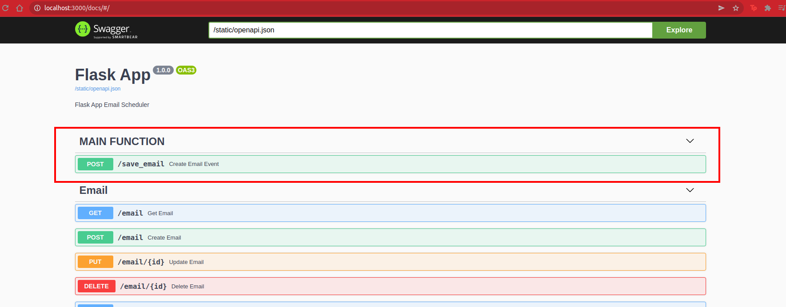

# Email Scheduler
Email scheduler app using Flask and SQLAlchemy

## How to run? (Ubuntu)
1. Create virtualenv
    ```
    python3 -m virtualenv env
    ```
2. Activate virtualenv
    ```
    . env/bin/activate
    ```
3. Upgrade pip and install `requirements.txt`
    ```
    python -m pip install --upgrade pip && pip install -r requirements.txt
    ```
4. Run the `main.py`
    ```
    python main.py
    ```

## How to open swagger-UI?
you can access it from here
```
http://localhost:3000/docs
```

## Snapshot of '\save_email' UI


# Notes:
- `docker-compose` is not ready yet