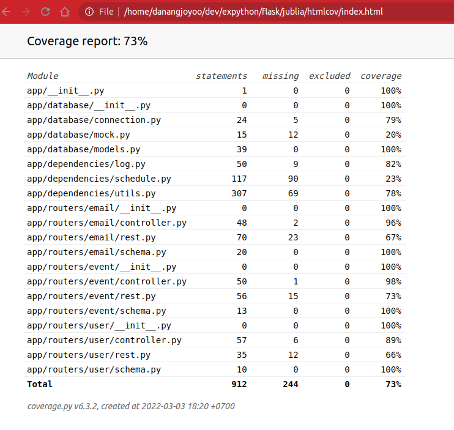

# Email Scheduler
Email scheduler app using Flask and SQLAlchemy

## How to run? (Ubuntu)
1. Create virtualenv
    ```
    python3 -m virtualenv env
    ```
2. Activate virtualenv
    ```
    . env/bin/activate
    ```
3. Upgrade pip and install `requirements.txt`
    ```
    python -m pip install --upgrade pip && pip install -r requirements.txt
    ```
4. Run the `main.py`
    ```
    python main.py
    ```

## How to stop?
You can click `CTRL+C` twice (2x) :
- 1st click to abort the worker
- 2nd click to stop Flask

## How to test?
- Specific Test File
    ```bash
    pytest tests/{file.py}
    ```
- Specific Test Function
    ```bash
    pytest tests/{file.py}::{function_name}
    ```
- Test All Created Case
    ```bash
    pytest
    ```
- Test All Created Case With Coverage
    ```bash
    pytest --cov=app
    ```
- Test All Created Case With Coverage HTML
    1. Run
        ```bash
        pytest --cov=app ==cov=report html
        ```
    2. Open `htmlcov/index.html` to your browser
        

## How to open swagger-UI?
you can access it from here
```
http://localhost:3000/docs
```

## Snapshot of '\save_email' UI


# Notes:
- `docker-compose` is not ready yet